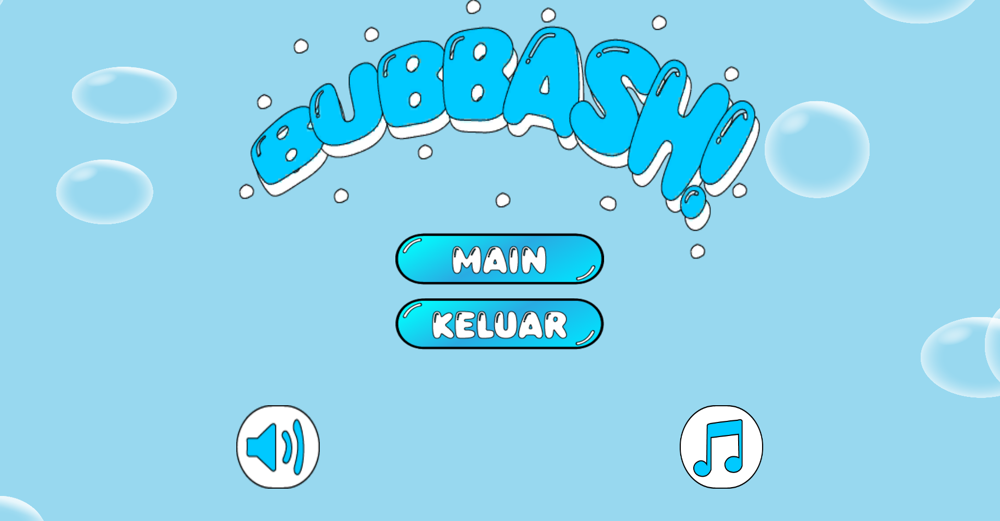

# Game Project Bubbash cloning onet using unity

Permainan Bubbash adalah permainan teka-teki di mana pemain harus mencocokan warna bubble yang identik dengan menghubungkan menggunakan garis yang tidak lebih dari dua belokan. Papan permainan terdiri dari grid gambar yang tertata acak, dan pemain harus mencari dua bubble yang sama untuk dicocokkan. Garis penghubung harus bebas dari halangan dan hanya bisa melengkung hingga dua kali. Dan permainana memiliki batasan waktu, sehingga pemain harus mencocokkan semua pasangan bubble sebelum waktu habis.

Team 9
1. Meisy Anggraini - Game Designer
2. M. Ainul Chakra - Game Designer
3. Muharromi Putra Ardhana - Game Programmer
4. Ibrahim Purwadinata - Game Artist

Installation Instructions
1. Download game nya dari situs resmi
https://globalgamejam.org/games/2025/bubbash-2
2. Kemudian ekstrak file nya menggunakan winrar / app yang lain
3. Buka file game bernama BUBBASH.exe
4. Enjoy the game~~~
